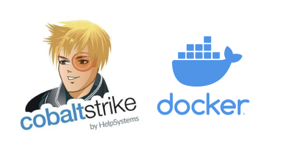

# Cobalt Strike Docker Container

This repository provides a Docker container for running a Cobalt Strike Teamserver.



## Overview
Cobalt Strike is a Red Team post-exploitation framework. This project aims to make deployment of Cobalt Strike straightforward using Docker Compose.

### Features
- **Easy deployment**: Quickly spin up a Cobalt Strike Teamserver with Docker Compose
- **Custom C2 profiles**: Load custom C2 profiles from the `./profiles` directory
- **Auto-Start Listeners**: Preconfigure listeners via environment variables (HTTP/S, DNS, SMB)
- **Robust Process Management**: Enhanced error handling and service management
- **Comprehensive Logging**: Detailed logs for troubleshooting

## Quick Start

### Prerequisites
- Valid Cobalt Strike License
- Docker and Docker Compose
- C2 Profile file

### Basic Usage
1. Create your docker-compose.yml:
```yaml
version: "3.8"
services:
  cobaltstrike:
    image: chryzsh/cobaltstrike
    container_name: cobaltstrike
    ports:
      - "50050:50050"
    volumes:
      - ./profiles:/opt/cobaltstrike/profiles
      - ./logs:/var/log/supervisor
    environment:
      - LICENSE_KEY=your_license_key_here
      - TEAMSERVER_PASSWORD=your_secure_password
      - C2_PROFILE_NAME=your.profile
    restart: unless-stopped
```

2. Start the container:
```bash
docker-compose up -d
```

## Documentation

For detailed information, please see the following guides:

- [Configuration Guide](docs/CONFIGURATION.md)
  - Environment variables
  - Docker Compose configuration
  - Volume mounts and port mappings
  - Security considerations

- [Troubleshooting Guide](docs/TROUBLESHOOTING.md)
  - Common issues and solutions
  - Log analysis
  - Recovery procedures

- [Architecture Documentation](docs/ARCHITECTURE.md)
  - Technical details
  - Implementation specifics
  - Design decisions

## Security Notes
- Use strong credentials
- Restrict access to trusted networks
- Ensure proper licensing and authorization

## Contributing
Contribute by submitting issues or pull requests. See [Architecture Documentation](docs/ARCHITECTURE.md) for technical details.

## Disclaimer
- This project is intended for **legal and authorized use only**
- Cobalt Strike is a commercial tool—ensure you have a valid license from [HelpSystems](https://www.helpsystems.com/)
- Maintainers are not responsible for misuse of this setup

## License
MIT License - See [LICENSE](LICENSE) for details
