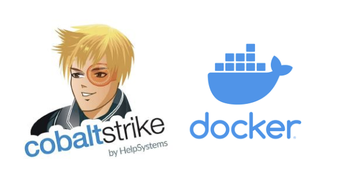

# Cobalt Strike Docker Container

This repository provides a Docker container for running a Cobalt Strike Teamserver.



## Overview
Cobalt Strike is a Red Team post-exploitation framework. This project aims to make deployment of Cobalt Strike straightforward using Docker Compose.

### Features
- **Easy deployment**: Quickly spin up a Cobalt Strike Teamserver with Docker Compose
- **Custom C2 profiles**: Load custom C2 profiles from the `./profiles` directory
- **Auto-Start Listeners**: Preconfigure listeners via environment variables (HTTP/S, DNS, SMB)
- **REST API Support**: Built-in REST API server for programmatic C2 operations (CS 4.12+)
- **Robust Process Management**: Enhanced error handling and service management
- **Comprehensive Logging**: Detailed logs for troubleshooting

## Quick Start

### Prerequisites
- Valid Cobalt Strike License
- Docker and Docker Compose
- C2 Profile file

### Basic Usage
1. Create your docker-compose.yml:
```yaml
version: "3.8"
services:
  cobaltstrike:
    image: chryzsh/cobaltstrike:latest
    container_name: cobaltstrike
    ports:
      - "50050:50050"  # Teamserver communication
      - "50443:50443"  # REST API
      - "53:53/udp"    # DNS listener
      - "443:443"      # HTTPS listener
      - "80:80"        # HTTP listener
    volumes:
      - ./profiles:/opt/cobaltstrike/profiles
      - ./server:/opt/cobaltstrike/server
      - ./logs:/var/log/supervisor
      - ./cobaltstrike-dist-linux.tgz:/opt/cobaltstrike/dist/cobaltstrike-dist-linux.tgz:ro  # Pre-staged tarball (recommended)
    environment:
      - LICENSE_KEY=your_license_key_here
      - TEAMSERVER_PASSWORD=your_secure_password
      - C2_PROFILE_NAME=your.profile
      - DNS_LISTENER_DOMAIN_NAME=ns1.example.com
      - DNS_LISTENER_STAGER_DOMAIN_NAME=ns1.example.com
      - SMB_LISTENER_NAMED_PIPE_NAME=msagent_pipe
    restart: unless-stopped
```

2. **Download the Cobalt Strike tarball** (recommended — the download server uses Cloudflare bot protection which blocks automated downloads):
   - Log into https://download.cobaltstrike.com with your license key in a browser
   - Download `cobaltstrike-dist-linux.tgz`
   - Place it in the same directory as your `docker-compose.yml`

3. Start the container:
```bash
docker-compose up -d
```

> **Note:** If you don't pre-stage the tarball, the container will attempt to download Cobalt Strike automatically. This may fail if Cloudflare blocks the request. Check `logs/cs_installer.out.log` for details.

## Upgrading

Cobalt Strike binaries live in `./server`, which is also where the teamserver keeps its runtime data (beacon keys, downloaded files, keystrokes, audit logs). The installer only installs once — if `./server/TeamServerImage` already exists, it skips straight to starting the teamserver on every restart. To upgrade, you force that check to fail again with a newer tarball staged, without touching the rest of `./server`.

`/opt/cobaltstrike` is owned by `root` inside the container (and on the host, since it's a bind mount) — run these as root/`sudo`.

1. **Back up first** (safety net): `cp -a ./server ./server.bak-$(date +%Y%m%d)`
2. **Download the new version's tarball** — log into https://download.cobaltstrike.com with your license key in a browser and grab `cobaltstrike-dist-linux.tgz` for the version you want. Replace the file referenced by your tarball mount in `docker-compose.yml`.
3. **Clear the install marker** so the installer re-runs: `rm ./server/TeamServerImage`
4. **Recreate the container — prefer this over just stop/start**: `docker compose down && docker compose up -d`. (`down` only removes the container itself — your bind-mounted `./server`, `./profiles`, and `./logs` are untouched.) The `teamserver` program's wait-loop now checks for `TeamServerImage` directly, not just `installer_done.flag`, so it won't race ahead of a reinstall even on a plain restart — but a full recreate still gives you the cleanest process tree, and `supervisorctl` is now wired up (see `docs/TROUBLESHOOTING.md`) if a service ever gets stuck in `FATAL` and needs recovering without a full recreate.
5. **Watch the install**: `tail -f logs/cs_installer.out.log`. The installer re-extracts the new tarball into `./server` — only files shipped in the tarball are overwritten, so `data/`, beacon keys, and audit logs are left alone — then re-runs Cobalt Strike's own `update.jar` step before starting the teamserver.
6. **Validate your C2 profile before trusting the result**: `./server/c2lint profiles/your.profile`. Major version bumps regularly drop or rename Malleable C2 options (e.g. 4.13 removed `stage.rdll_loader` and `stage.smartinject`) — an old profile that worked fine on the previous version can silently fail to compile on the new one and block the teamserver from starting. Fix any reported errors in your profile, re-run `c2lint` until it's clean, then restart.
7. **Confirm the version** in `logs/teamserver.out.log`, or by connecting with the CS client and checking Help > About.

Note: `docker-compose` (hyphenated v1) may not be installed on newer hosts — use `docker compose` (the v2 CLI plugin, space not hyphen) if the hyphenated form errors with "command not found".

> **Alternative:** if the container hasn't been recreated since the last install (so `update.jar` still exists in its filesystem layer), you can try Cobalt Strike's incremental updater in place, without staging a new tarball:
> ```bash
> docker exec -it cobaltstrike bash -c 'cd /opt/cobaltstrike && echo "$LICENSE_KEY" | java -jar update.jar -Type:linux'
> docker restart cobaltstrike
> ```
> This hits the same `download.cobaltstrike.com` endpoint that Cloudflare blocks for automated requests, so it may fail — fall back to the tarball-swap steps above if it does.

## Documentation

For detailed information, please see the following guides:

- [Configuration Guide](docs/CONFIGURATION.md)
  - Environment variables
  - Docker Compose configuration
  - Volume mounts and port mappings
  - Security considerations

- [Troubleshooting Guide](docs/TROUBLESHOOTING.md)
  - Common issues and solutions
  - Log analysis
  - Recovery procedures

- [Architecture Documentation](docs/ARCHITECTURE.md)
  - Technical details
  - Implementation specifics
  - Design decisions

## Security Notes
- Use strong credentials
- Restrict access to trusted networks
- Ensure proper licensing and authorization

## Contributing
Contribute by submitting issues or pull requests. See [Architecture Documentation](docs/ARCHITECTURE.md) for technical details.

## Disclaimer
- This project is intended for **legal and authorized use only**
- Cobalt Strike is a commercial tool—ensure you have a valid license from [HelpSystems](https://www.helpsystems.com/)
- Maintainers are not responsible for misuse of this setup

## License
MIT License - See [LICENSE](LICENSE) for details
